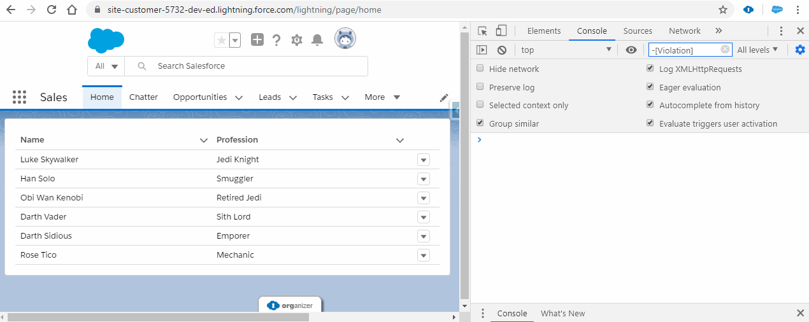

# Dynamic Lightning Datatable Actions

Lightning Datatable is one of the more powerful base Lightning Web Components. This component allows developer to display multiple rows of objects with dynamically formatted columns for a variety of data types. 
Lightning Datatable’s action column allows a developer to specify a list of actions which are available for the user to select. 
This is great for most use cases, but the actions are defined as a constant, which means that every row must share the same actions.

### Simple Demonstration
Here is a simple demonstration of a lightning datatable with dynamic row actions

### Limitations
Unfortunately there is one minor limitation to this implementation. If a row has no actions, the drop-down arrow will still show and clicking it will display an empty list.

